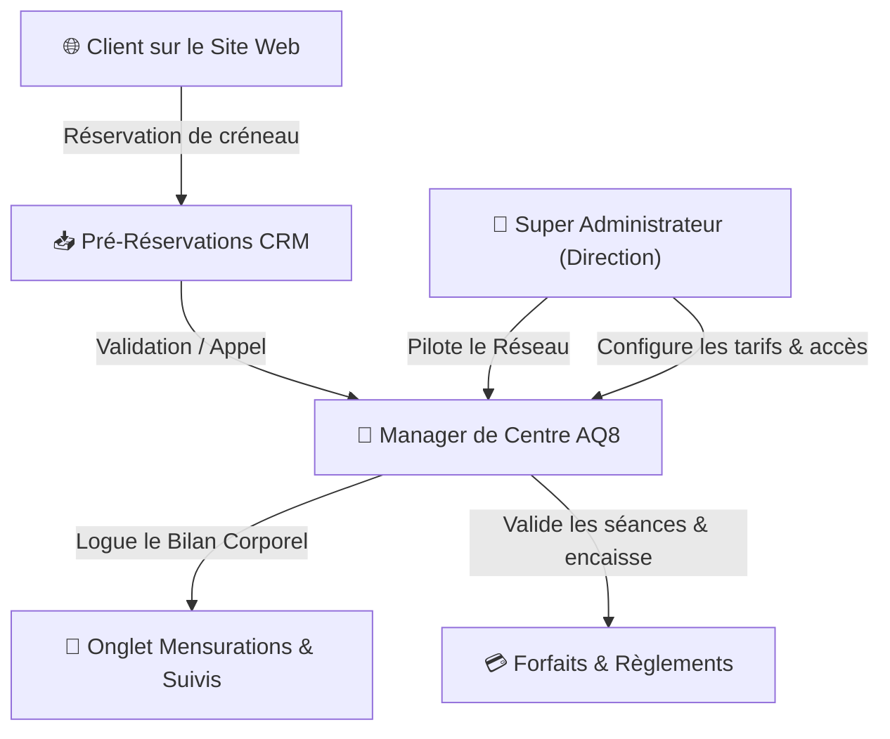

# 📘 GUIDE OFFICIEL D'UTILISATION & DOCUMENTATION CRM — AQ8 ALGÉRIE

> [!IMPORTANT]
> **Document de Livraison & Manuel de Prise en Main**  
> Ce guide officiel est destiné au **Super Administrateur** (Direction générale du réseau) et aux **Managers de Centres AQ8 Algérie**. Il a été conçu de manière simple, claire et sans jargon technique pour faciliter la prise en main immédiate.

---

## 📌 TABLE DES MATIÈRES

1. [Vue d'ensemble de la Plateforme AQ8](#1-vue-densemble-de-la-plateforme-aq8)
2. [PARTIE 1 : GUIDE DE LA DIRECTION (SUPER ADMINISTRATEUR)](#partie-1--guide-de-la-direction-super-administrateur)
   - [2.1. Tableau de bord Réseau & Statistiques Globales](#21-tableau-de-bord-réseau--statistiques-globales)
   - [2.2. Création et Configuration d'un Centre AQ8](#22-création-et-configuration-dun-centre-aq8)
   - [2.3. Création et Gestion des Accès des Managers](#23-création-et-gestion-des-accès-des-managers)
   - [2.4. Tarifications & Habilitations des Prestations / Forfaits](#24-tarifications--habilitations-des-prestations--forfaits)
   - [2.5. Pôle Éditorial (Blog & Actualités du Site Web)](#25-pôle-éditorial-blog--actualités-du-site-web)
   - [2.6. Journal d'Audit & Sécurité Réseau](#26-journal-daudit--sécurité-réseau)
3. [PARTIE 2 : GUIDE EXPLOITATION QUOTIDIENNE (MANAGERS DE CENTRES)](#partie-2--guide-exploitation-quotidienne-managers-de-centres)
   - [3.1. Première Connexion & Sécurité du Compte](#31-première-connexion--sécurité-du-compte)
   - [3.2. Tableau de Bord du Centre (Planning du Jour)](#32-tableau-de-bord-du-centre-planning-du-jour)
   - [3.3. Gestion des Pré-Réservations issues du Site Web](#33-gestion-des-pré-réservations-issues-du-site-web)
   - [3.4. Gestion du Fichier Clients & Fiches Détaillées](#34-gestion-du-fichier-clients--fiches-détaillées)
   - [3.5. Onglet « Mensurations et suivis » (Nouveau !)](#35-onglet--mensurations-et-suivis--nouveau-)
   - [3.6. Vente de Forfaits & Enregistrement des Règlements](#36-vente-de-forfaits--enregistrement-des-règlements)
4. [FOIRE AUX QUESTIONS (F.A.Q) & ASSISTANCE](#foire-aux-questions-faq--assistance)

---

## 1. Vue d'ensemble de la Plateforme AQ8

La plateforme **AQ8 Algérie** rassemble sur un même outil :
- **Le Site Web Public** : Présentation du réseau AQ8, simulateur de programmes, réservation instantanée de créneaux en ligne et espace client dédié.
- **Le CRM Administrateur (Direction)** : Pilotage global du réseau, statistiques financières, création des centres et gestion des droits d'accès.
- **Le CRM Manager (Exploitation Centre)** : Gestion quotidienne du centre, planning des rendez-vous, suivi des mensurations clients, vente de forfaits et encaissements.



---

## PARTIE 1 : GUIDE DE LA DIRECTION (SUPER ADMINISTRATEUR)

> **Public concerné** : Direction AQ8, Administrateurs Réseau.  
> **Accès** : Connexion via l'adresse e-mail Administrateur sur `/crm`.

### 2.1. Tableau de bord Réseau & Statistiques Globales
Dès votre connexion, l'onglet **« Vue Globale »** vous présente une vision à 360° des performances du réseau AQ8 Algérie :
- **Nombre total d'adhérents actifs** dans l'ensemble des centres.
- **Volume de séances effectuées** sur le mois et sur l'année.
- **Chiffre d'affaires global** ventilé par centre et par type de technologie (*AQ8 EMS* vs *Wonder Body Sculpt*).
- **Remplissage des plannings** et comparatif de rentabilité entre les centres.

---

### 2.2. Création et Configuration d'un Centre AQ8
Pour ajouter un nouveau centre ou modifier les paramètres d'un centre existant :

1. Cliquez sur le bouton **« + Ajouter un nouveau centre »** (ou sur l'icône de modification d'un centre).
2. Complétez les **4 onglets de configuration** :
   - 🏢 **1. Général** : Nom du centre (*ex: AQ8 Sidi Yahia*), Wilaya/Ville, adresse complète, téléphone direct, e-mail professionnel et photo officielle.
   - ⏰ **2. Horaires & Genres** : Horaires généraux d'ouverture, ainsi que les **créneaux réservés exclusivement aux Femmes ou aux Hommes**.
   - ⚡ **3. Équipements & Consoles** : Matériel disponible dans le centre (consoles sans fil AQ8, consoles Wonder).
   - 📋 **4. Règles & Consignes** : Statut (*Actif, Suspendu, Maintenance*), règles d'annulation de séance (ex: *24h à l'avance*) et consignes spécifiques transmises aux clients.

---

### 2.3. Création et Gestion des Accès des Managers

> [!TIP]
> **Sécurité Maximale**  
> Chaque manager dispose d'un accès strictement étanche : il n'a accès qu'aux données et clients de son propre centre.

Pour créer l'accès d'un nouveau manager de centre :
1. Rendez-vous dans l'onglet **« Gestion des Managers »** (ou directement lors de la création d'un centre).
2. Cliquez sur **« + Créer un gérant »**.
3. Renseignez :
   - **Nom complet** (ex: *Amel Mansouri*).
   - **Adresse e-mail professionnelle** (ex: *amel@aq8algerie.com*).
   - **Affectation au Centre** (sélectionnez le centre attribué).
   - **Statut Actif** (coché pour autoriser la connexion).
4. Cliquez sur **« Enregistrer »**.

> **Comment le manager définit-il son mot de passe ?**  
> Le manager se rend sur `/crm`, saisit son e-mail et clique sur *"Mot de passe oublié / Initialiser"*. Il reçoit instantanément un e-mail officiel AQ8 sur son adresse avec un bouton sécurisé pour définir son mot de passe personnel.

---

### 2.4. Tarifications & Habilitations des Prestations / Forfaits
La direction peut ajuster le catalogue de prestations et de forfaits :
- **Activation / Désactivation** : Choisissez quelles prestations (*Coaching EMS Privé, Duo, Wonder Sculpt*) et quels forfaits (*8 séances, 12 séances, Annuel*) sont commercialisés dans chaque centre.
- **Prix Locaux** : Définissez le tarif en DZD propre à chaque établissement si les prix varient selon la wilaya.

---

### 2.5. Pôle Éditorial (Blog & Actualités du Site Web)
Depuis l'onglet **« Pôle Éditorial »**, la direction gère les articles publiés sur le site web public :
- Rédaction d'articles d'experts sur l'EMS, la perte de poids et le renforcement musculaire.
- Association d'images haute définition et optimisation du référencement (SEO).
- Publication ou mise en brouillon en un clic.

---

### 2.6. Journal d'Audit & Sécurité Réseau
L'onglet **« Journal d'Audit »** enregistre en temps réel chaque action effectuée sur le CRM :
- Date et heure précise.
- Auteur de l'action (Super Admin ou Manager de Centre).
- Nature de l'opération (*Attribution de forfait, Encaissement de paiement, Modification de fiche client, Suppression*).

---

## PARTIE 2 : GUIDE EXPLOITATION QUOTIDIENNE (MANAGERS DE CENTRES)

> **Public concerné** : Responsables et Managers de Centres AQ8 Algérie.  
> **Objectif** : Assurer l'accueil des adhérents, le suivi des bilans corporels, les réservations et les encaissements.

### 3.1. Première Connexion & Sécurité du Compte
1. Ouvrez l'adresse de votre espace CRM (ex: `https://aq8algerie.com/crm`).
2. Saisissez votre adresse e-mail professionnelle fournie par la direction.
3. Lors de votre toute première connexion :
   - Cliquez sur **« Mot de passe oublié / Initialiser »**.
   - Consultez votre boîte mail et cliquez sur le bouton rouge **« Définir mon mot de passe »**.
   - Choisissez un mot de passe sécurisé (minimum 8 caractères).
4. Une fois connecté, vous arrivez directement sur le tableau de bord de votre centre.

---

### 3.2. Tableau de Bord du Centre (Planning du Jour)
Le tableau de bord est le cœur de votre journée de travail :
- **Séances du Jour** : Liste chronologique de tous les rendez-vous prévus aujourd'hui.
- **Bouton « Marquer Effectuée »** : Lorsqu'un adhérent termine sa séance, cliquez sur ce bouton. Une séance est automatiquement déduite de son forfait.
- **Statut des Créneaux** : Visualisation claire des créneaux Femmes (rose), Hommes (bleu) et Mixte.

---

### 3.3. Gestion des Pré-Réservations issues du Site Web
Lorsqu'un client effectue une demande de réservation depuis le site web public :
1. Une alerte apparaît dans votre onglet **« Demandes Web »**.
2. La fiche récapitule : *Nom du client, téléphone, prestation souhaitée, date et heure demandées*.
3. **Actions possibles** :
   - **Confirmer** : Le créneau est validé et passe automatiquement dans le planning principal. Le client reçoit un e-mail de confirmation.
   - **Proposer un autre horaire / Contacter** : Le bouton WhatsApp direct et le bouton d'appel téléphonique vous permettent de contacter l'adhérent en 1 clic.

---

### 3.4. Gestion du Fichier Clients & Fiches Détaillées
L'onglet **« Fichier Clients »** regroupe tous les membres inscrits dans votre centre :
- **Recherche rapide** par nom, prénom ou numéro de téléphone.
- **Bouton « + Nouveau Client »** pour inscrire un nouvel adhérent au centre (coordonnées, groupe sanguin, contact d'urgence, objectifs sportifs et alertes médicales).
- Cliquez sur le nom d'un client pour ouvrir sa **Fiche Client Complète**.

---

### 3.5. Onglet « Mensurations et suivis » (Nouveau !)

> [!TIP]
> **Fonctionnalité Majeure de Fidélisation**  
> Le suivi des mensurations permet d'apporter une preuve concrète des résultats à vos adhérents au fil des semaines.

Dans la fiche d'un client, cliquez sur l'onglet **« Mensurations et suivis »** pour accéder au dossier anatomique :

+-------------------------------------------------------------------------+
|                    ONGLET : MENSUATIONS ET SUIVIS                       |
+-------------------------------------------------------------------------+
|  [ 📏 Ajouter mensurations ]                                             |
|  [ 💳 Ajouter un paiement / Forfait ]                                    |
|  🏆 CARTE DU DERNIER BILAN                                              |
|  • Date : 08/08/2026   • Poids : 71.2 kg (-3.3 kg depuis l'origine)     |
|  • Tour de Taille : 80 cm   • Hanches : 105 cm   • Masse Grasse : 30.1% |
|                                                                         |
|  📋 TABLEAU HISTORIQUE DES RELEVÉS                                      |
|  +------------+-------+--------+---------+---------+--------+--------+  |
|  | Date       | Poids | Taille | Hanches | Cuisses | Gras % | Muscle%|  |
|  +------------+-------+--------+---------+---------+--------+--------+  |
|  | 10/06/2026 | 71.2  | 80 cm  | 105 cm  | 59 cm   | 30.1%  | 25.3%  |  |
|  | 10/05/2026 | 74.5  | 84 cm  | 108 cm  | 62 cm   | 32.4%  | 24.1%  |  |
|  +------------+-------+--------+---------+---------+--------+--------+  |
|                                                                         |
|  📈 GRAPHIQUE D'ÉVOLUTION DU POIDS ET DE LA MASSE GRAISSEUSE            |
|  [Courbe dynamique illustrant l'amincissement de l'adhérent]           |
+-------------------------------------------------------------------------+
```

#### Comment enregistrer un nouveau bilan corporel ?
1. Dans l'onglet **« Mensurations et suivis »**, cliquez sur le bouton rouge **« Loguer des mensurations »**.
2. Remplissez les données relevées lors du bilan en centre :
   - **Poids (kg)** *(Obligatoire)*
   - **Masse Grasse (%) & Masse Musculaire (%)** *(InBody / Impedancemètre)*
   - **Tours de taille, hanches, cuisses et poitrine (cm)**
3. Cliquez sur **« Enregistrer »**.
4. Le tableau et le graphique d'évolution se mettent à jour instantanément !

---

### 3.6. Vente de Forfaits & Enregistrement des Règlements

#### Attribution d'un Forfait à un Adhérent :
1. Dans la fiche du client, cliquez sur **« Attribuer un Forfait »**.
2. Sélectionnez le forfait choisi (*ex: Forfait 12 Séances EMS*).
3. Le solde de séances de l'adhérent est automatiquement crédité.

#### Enregistrement du Paiement :
1. Cliquez sur **« Enregistrer un Règlement »**.
2. Indiquez le montant encaissé en DZD, le mode de règlement (*Espèces, Carte CIB/EDAHABIA, Virement/Chèque*) et le numéro de reçu.
3. Un reçu de paiement est généré et envoyé automatiquement par e-mail au client.

---

## FOIRE AUX QUESTIONS (F.A.Q) & ASSISTANCE

### ❓ Question 1 : Un adhérent n'a pas reçu son e-mail de confirmation ou de reçu ?
- **Réponse** : Les e-mails sont envoyés depuis l'adresse officielle `notifications@aq8algerie.com`. Demandez à l'adhérent de vérifier son dossier "Courrier Indésirable / Spam". Vous pouvez également lui renvoyer la confirmation directement par WhatsApp via le bouton dédié sur le CRM.

### ❓ Question 2 : Comment annuler ou déplacer une séance sans perdre de crédit ?
- **Réponse** : Ouvrez le rendez-vous sur le planning du jour et modifiez l'horaire. Si la séance est annulée au moins 24h à l'avance, choisissez le statut "Annulée" : aucun crédit ne sera déduit du forfait du client.

### ❓ Question 3 : Que faire en cas d'oubli de mot de passe Manager ?
- **Réponse** : Sur la page de connexion `/crm`, cliquez sur "Mot de passe oublié". Saisissez votre adresse e-mail professionnelle pour recevoir immédiatement un lien de réinitialisation sécurisé.

---

> **Support Technique & Assistance AQ8 Algérie**  
> 📞 **Téléphone Assistance** : `+213 795 12 84 09`  
> ✉️ **E-mail Support** : `aq8algerie@gmail.com`  
> 🌐 **Plateforme CRM** : `https://aq8algerie.com/crm`
